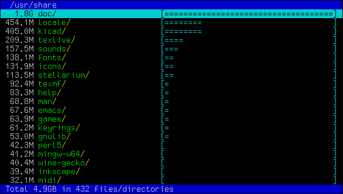

### Introduction

Duc is a collection of tools for indexing, inspecting and visualizing disk
usage. Duc maintains a database of accumulated sizes of directories of the file
system, and allows you to query this database with some tools, or create fancy
graphs showing you where your bytes are.

Duc comes with console utilities, ncursesw and X11 user interfaces and a CGI
wrapper for disk usage querying and visualisation.

Duc is designed to scale to huge filesystems: it will index and display
hundreds of millions of files on petabytes of storage without problems.

For more information, check the manual page at http://htmlpreview.github.io/?https://github.com/zevv/duc/blob/master/doc/duc.1.html

 

### Install

Duc depends on the Cairo and Pango libraries for drawing graphs. The ncursesw
library is required for the curses user interface.

Depending on available libraries or required functionality you can disable
certain features of duc by passing any of the below switches to ./configure:

    --disable-graph         disable graph drawing [default=yes]
    --disable-ui            disable ncursesw ui [default=yes]
    --disable-gui           disable X11 gui [default=yes]
    --with-db-backend=ARG   choose db backend (tokyocabinet,leveldb,sqlite3) [tokyocabinet]

The database engine is configurable at build time, at this time Tokyocabinet,
Leveldb and Sqlite3 are supported. Duc uses Tokyocabinet by default: the
performance is acceptable and generates in the smallest database size.

To get the required dependencies on Debian or Ubuntu, run:

    $ sudo apt-get install libncursesw5-dev libcairo2-dev libpango1.0-dev \
      build-essential

depending on the database library, also install `libtokyocabinet-dev`,
`libleveldb-dev` or `libsqlite3-dev`.

On RHEL or CentOS systems, you need to do:

    $ sudo yum install pango-devel cairo-devel tokyocabinet-devel 

#### Building from a release

To build from a release, download the tgz tarball from
https://github.com/zevv/duc/releases and do the usual thing:

    $ ./configure
    $ make
    $ sudo make install

#### Building from Git

When building the latest version from the Git repo you will need to have
autotools installed and run `autoreconf --install` to generate the
`./configure` script yourself.

### Usage

Duc comes with a command line tool called `duc`, which is used to create,
maintain and query the disk usage database.  run `duc help` to get a list of
available commands. `duc help <subcommand>` describes the usage of a specific
subcommand.

Extensive documentation is available in the 

### License

This package is free software; you can redistribute it and/or modify it under
the terms of the GNU General Public License as published by the Free Software
Foundation; version 2 dated June, 1991. This package is distributed in the hope
that it will be useful, but WITHOUT ANY WARRANTY; without even the implied
warranty of MERCHANTABILITY or FITNESS FOR A PARTICULAR PURPOSE. See the GNU
General Public License for more details.

